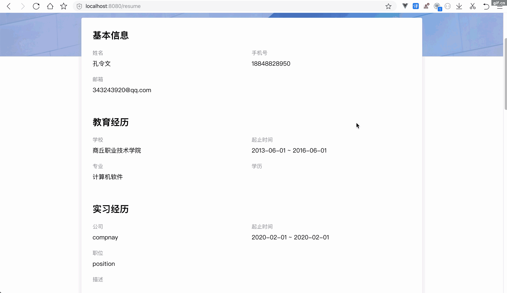

# vue-bytedancejob

一个`Vue`重构字节跳动公司招聘官网的单页面应用

## 线上预览

[http://123.56.124.33:3000](http://123.56.124.33:3000)

## Clone project

```bash
git clone git@github.com:konglingwen94/vue-bytedanceJob.git
```

## Project setup

```bash
npm install
```

### Compiles and hot-reloads for development

```bash
npm run dev    
```
默认启动 <http://localhost:8080>
### Start server API

```bash
npm  run server      默认监听`http://localhost:3000`
```

> 默认不需要启动，如果需要调试服务器接口，请配置根目录下的`vue.config.js`文件，默认配置如下

```js
module.exports = {
  devServer: {
    proxy: "http://123.56.124.33:3000",
   //  proxy: "http://localhost:3000",
  },
};
```

### Compiles and minifies for production

```bash
npm run build
```

## 主要功能

- [x] 首页
- [x] 公司信息介绍
- [x] 职位关键字搜索
- [x] 城市职位检索
- [x] 职位分类检索
- [x] 职位列表分页展示
- [x] 职位详情
- [x] 产品与服务
- [x] 员工故事
- [x] 校园招聘(外链)

- [ ] 注册（由于服务端接口代理有一定的复杂度此功能暂未实现，。欢迎有兴趣的同学协同实现此功能）
- [ ] 登录
  - [x] 邮箱登录（需要官方网站注册邮箱账号）
  - [ ] 手机号登录
- [x] 退出
- [ ] 简历投递
- [x] 简历
  - [x] 我的简历
  - [x] 简历上传
  - [x] 编辑简历
  - [x] 保存简历

## 技术栈

`vue` `vue-router`

`vue-cli` `less`

`axios` `lodash` `es6~7`

`express` `node-fetch` `http-proxy-middleware`

## 项目结构

<b><details><summary>组件</summary></b>

```
components
├── Bytedance-Button.vue  //主题按钮，可定制尺寸
├── Checkbox-Transfer.vue // 复选框穿梭选择器，用来选择搜索职位
├── File-Icon.vue            文件上传后可显示指定的图标
├── Input-Search.vue       搜索输入框
├── Loading                数据加载组件（支持API调用和指令调用）
│   ├── Loading.vue
│   └── main.js
├── Logo.vue            主题颜色可变的logo组件
├── Pagination.vue      分页器组件
├── footer.vue
└── header.vue

```

</details>

<b><details><summary>页面</summary></b>

```
views
├── Home.vue            首页
├── JobDetail.vue       职位详情
├── Jobs.vue            职位列表浏览
├── Products.vue        产品展示
├── Resume.vue          简历预览
├── ResumeEditor.vue    编辑简历
├── StaffStory.vue      员工故事
└── User.vue            用户

```

 </details>

<b><details><summary>辅助工具</summary></b>

```
src/helper
├── notification.plugin.js     项目全局消息通知插件，只在开发环境使用，辅助开发
├── registerElementComponents.js  按需引入第三方组件库
├── registerGlobalComponents.js    全局注册手动开发的组件
├── request.js                   不带有`token`的`axios`请求示例
├── requestWithToken.js      带有`token`的`axios`请求示例,主要包含简历相关的接口
└── utilities.js        其他工具函数
```

</details>

<b><details><summary>静态资源文件`/src/assets`</summary></b>

```
src/assets
└── style   样式
    ├── global.css      自定义全局样式
    ├── mixin.less      定义的混入样式
    ├── reset.css       重置浏览器默认样式
    └── variable.less      项目全局变量
```

</details>

<b><details><summary>服务端</summary></b>

```
server
├── app.js                     项目启动入口
├── controller      代理请求回调函数目录
│   ├── jobs.js                  职位
│   ├── productAndStandard.js    产品和字节范
│   ├── request.js               代理请求示例
│   └── staff-stories.js       员工故事
├── data.json     页面静态数据存放文件
├── package.json
└── router.js     代理接口路由

```
</details>

<b><details><summary>源代码其他文件</summary></b>
```
├── src
│   ├── App.vue       入口组件
│   ├── main.js       应用入口  
│   ├── router          路由
│   │   └── index.js
│   ├── store        全局共享状态
│   │   └── index.js
```
</details>

<b><details><summary>根目录</summary></b>

```
vue-bytedanceJob
├── docs/       服务端接口文档
├── public/     项目公共文件
├── server/       服务端目录
├── src/          代码源目录
├── test/         
├── README.md     项目介绍文档
├── babel.config.js   按需引入第三方库在这里配置
├── package.json     项目包介绍
└── vue.config.js    项目配置
```
</details>

## 项目截图

<br>
<br>
<br>
<br>
<br>



## 支持

如果看完此项目对您学习`Vue`有帮助的话，请您动手点一下`star`，有了您的支持，我会有更大的动力开源更多有趣的项目出来，谢谢！

由于服务端部分接口尚未获取到，有部分功能待实现。如果您对本项目有兴趣的话，也欢迎您能贡献代码！

> 查看本项目技术解密文章请点击我的个人博客[https://juejin.im/post/5ef338c75188252e7f772aee](https://juejin.im/post/5ef338c75188252e7f772aee)查看，欢迎点赞和留言！

