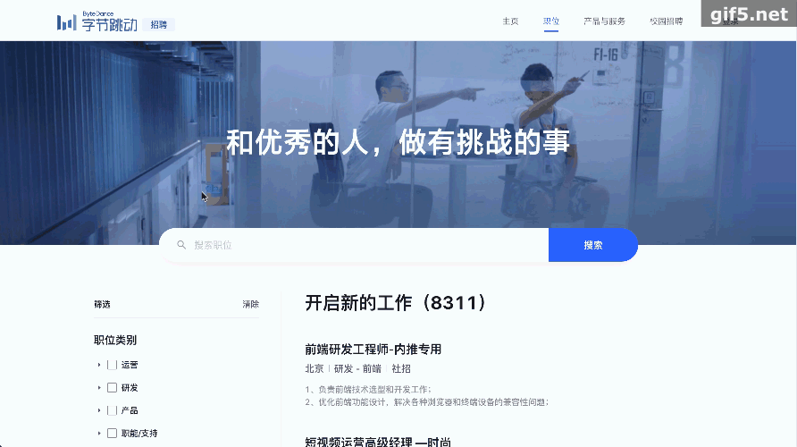
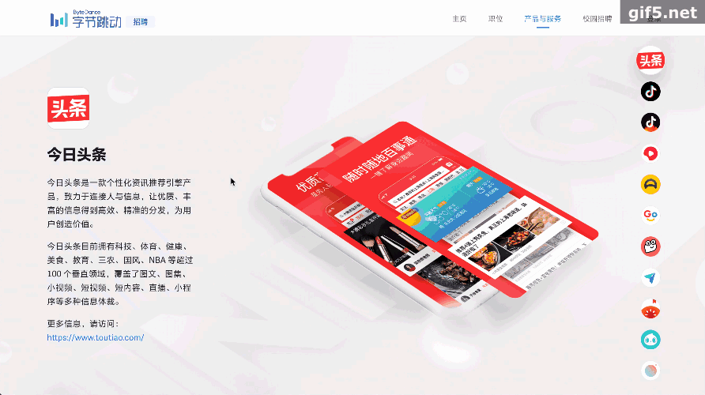

# vue-byte_dance_job

高仿字节跳动招聘官网的单页面应用

## 线上预览

[http://123.56.124.33:3000](http://123.56.124.33:3000)


## Project setup

```
npm install
```

### Compiles and hot-reloads for development

```
npm run dev
```

### Start server API

```
npm  run server
```

### Compiles and minifies for production

```
npm run build
```

## 主要功能

- [x] 首页
- [x] 公司信息介绍
- [x] 职位关键字搜索
- [x] 城市职位检索
- [x] 职位分类检索
- [x] 职位列表分页展示
- [x] 职位详情
- [x] 产品与服务
- [x] 员工故事
- [x] 校园招聘

- [ ] 登录
- [ ] 简历投递

## 技术栈

`vue` `vue-router`

`vue-cli` `less`

`axios` `lodash` `es6`

`express` `node-fetch`

## 服务端`API`

1. [首页](./docs/api/home.md)
   - http://123.56.124.33:3000/api/staff-stories
   - http://123.56.124.33:3000/api/byte-standards
2. [产品](./docs/api/product.md)

   - http://123.56.124.33:3000/api/products

3. [职位](./docs/api/job.md)

   - http://123.56.124.33:3000/api/jobs

   * http://123.56.124.33:3000/api/jobs/6826273638594103559

   - http://123.56.124.33:3000/api/job-filters

   * http://123.56.124.33:3000/api/job-categories

## 项目结构

```
vue-byte_dance_job
├── public
│   ├── favicon.ico
│   └── index.html
├── screenshots
│   ├── home.gif
│   ├── job.gif
│   ├── jobDetail.gif
│   ├── navbar.gif
│   ├── previewQrcode.png
│   ├── product.gif
│   └── staffStory.gif
├── server
│   ├── controller
│   │   ├── jobs.js
│   │   ├── productAndStandard.js
│   │   ├── request.js
│   │   └── staff-stories.js
│   ├── app.js
│   ├── data.json
│   ├── package-lock.json
│   ├── package.json
│   └── router.js
├── src
│   ├── assets
│   │   └── style
│   │       ├── global.css
│   │       ├── mixin.less
│   │       ├── reset.css
│   │       └── variable.less
│   ├── components
│   │   ├── Bytedance-Button.vue
│   │   ├── Checkbox-Transfer.vue
│   │   ├── Footer.vue
│   │   ├── Header.vue
│   │   ├── Input-Search.vue
│   │   ├── Logo.vue
│   │   └── Pagination.vue
│   ├── helper
│   │   ├── registerGlobalComponents.js
│   │   ├── request.js
│   │   └── utilities.js
│   ├── router
│   │   └── index.js
│   ├── views
│   │   ├── Home.vue
│   │   ├── JobDetail.vue
│   │   ├── Jobs.vue
│   │   ├── Products.vue
│   │   └── StaffStory.vue
│   ├── App.vue
│   └── main.js
├── test
├── README.md
├── babel.config.js
├── deploy.local.sh
├── deploy.sh
├── package-lock.json
├── package.json
└── vue.config.js


```

## 项目截图

<br>
<br>
<br>
<br>
<br>

